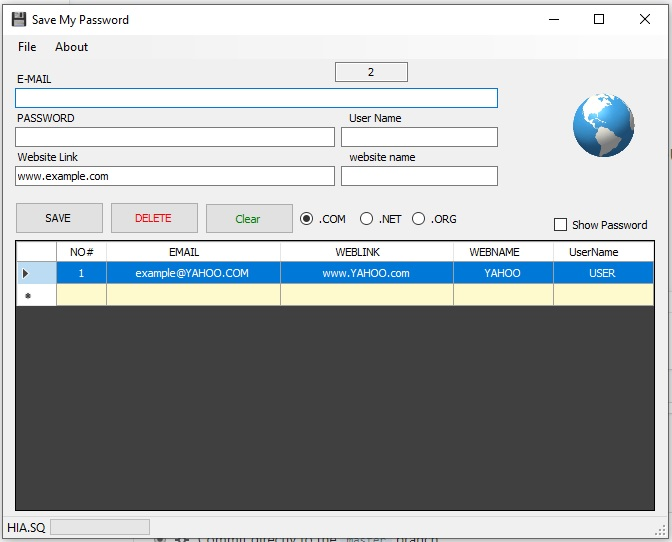

# Save-My-Password
    
## A program to save your data and passwords :floppy_disk:  
* **first edition**
v 1.00 (2019-02-15)
* 


```
    USER : ADMIN
PASSWORD : 123
```
# A New Release Is Available
* **Second Edition**
v 0.2 (2019-07-26)
* 


```
SAVE MY PASSWORD V0.2
* What's New
1- Fix Some Errors
2- Fix Some Errors When Trying To Save Data.
3- Change the entire design.
4- The Program Working More Efficiently Than The Old Version.```
```
This software was released for personal use.
After that I posted for free to anyone who wanted it
# What is the function of the program?
First I designed the program for personal use so that
I can access all the website registered with it easily
# Program Features!
* Save all my information and easily accessible
* (Contains an Access-type database)
* The database is not saved by synchronizing or uploading online
There is no online database and the program does not
relate to any form of the Internet
only check for an update useing web page for it.
# The disadvantages of the program!
* It contains an Access database. If a device is hacked or
accessed in any way, all your information may leak and be manipulated to collect your
account on the Internet. Because the database is not well protected.
* I can not take responsibility for any leakage of your data. If necessary,
I can detect the source code built into the program to make sure that there are no
malicious programs inside the program or that the program is uploading your database.
# How can I check the trust of the program or trust you?
* If you do not trust the program dont used it. 
Also never trust anyone on the internet. But here I do not force you to use this program, 
and with this program very secure, but I can not protect it from hacking or leaking data, 
You protect it as best you can.

 ## ask yourself?
- [x] use it!
- [ ] dont use it!
- [ ] mybe later!


follow on twitter [HIASQ](https://twitter.com/HIASQ2)
